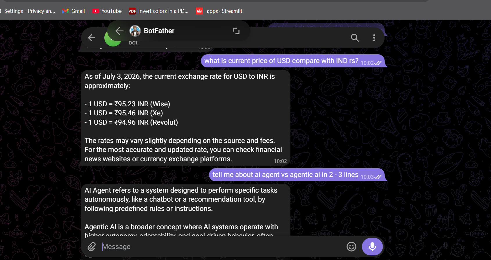
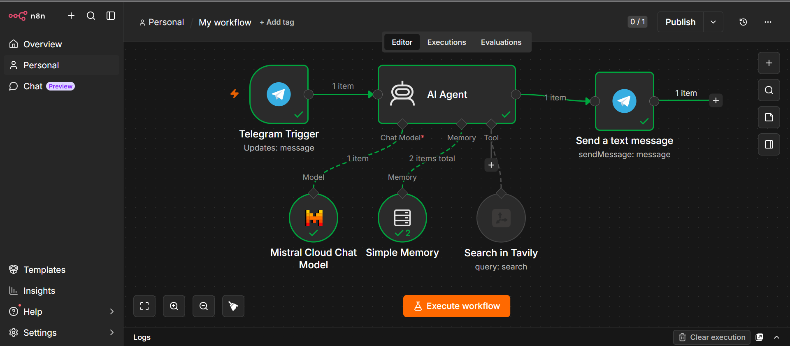

# 🤖 Telegram AI Agent (n8n)

An intelligent, production-ready Telegram chatbot built with **n8n**, **Mistral AI**, and **Tavily Search**. The agent chats naturally, searches the web when needed, and remembers conversation context — all orchestrated through a no-code n8n workflow and deployable in minutes on Render.

<p align="center">
  
  
  
  
</p>

---

## ✨ Features

| Feature | Description |
|---|---|
| 💬 Natural Conversation | ChatGPT-style responses powered by Mistral AI |
| 🌍 Live Web Search | Fetches real-time information via Tavily when queries need it |
| 🧠 Conversation Memory | Retains context across messages for coherent multi-turn chats |
| ⚡ Instant Replies | Low-latency responses delivered directly through Telegram |
| ☁️ Cloud Deployment | One-click deploy to Render with environment variable support |
| 🔧 Fully Visual Workflow | Built entirely in n8n — no backend code required |

---

## 🏗️ Architecture

```
Telegram User
      │
      ▼
Telegram Trigger
      │
      ▼
   AI Agent
      ├── Mistral Chat Model
      ├── Tavily Search Tool
      └── Simple Memory
      │
      ▼
Telegram Send Message
```

The agent receives a message via the **Telegram Trigger**, reasons over it using the **Mistral Chat Model**, optionally calls the **Tavily Search Tool** for current information, retains context through **Simple Memory**, and returns the response through **Telegram Send Message**.

---

## 🛠️ Tech Stack

- **[n8n](https://n8n.io/)** — Workflow automation engine
- **[Telegram Bot API](https://core.telegram.org/bots/api)** — Messaging interface
- **[Mistral AI](https://mistral.ai/)** — Language model for chat responses
- **[Tavily Search](https://tavily.com/)** — Real-time web search tool
- **Docker** — Containerized deployment
- **[Render](https://render.com/)** — Cloud hosting platform

---

## 🚀 Getting Started

### 1. Clone the Repository

```bash
git clone https://github.com/YOUR_USERNAME/Telegram-ai-agent-n8n.git
cd Telegram-ai-agent-n8n
```

### 2. Create a Telegram Bot

Create a new bot using [@BotFather](https://t.me/BotFather) on Telegram and save the generated bot token.

### 3. Get API Keys

You'll need API keys for:
- [Mistral AI](https://console.mistral.ai/)
- [Tavily AI](https://app.tavily.com/)

### 4. Import the Workflow

In your n8n instance, import the workflow file:

```
workflow/telegram_ai_agent.json
```

### 5. Configure Credentials

Inside n8n, add credentials for:
- **Telegram** (bot token)
- **Mistral AI** (API key)
- **Tavily** (API key)

### 6. Activate the Workflow

Toggle the workflow to **Active** in n8n. Your bot is now live and ready to respond on Telegram.

---

## ☁️ Deployment on Render

This project is designed to deploy seamlessly on Render using Docker. Configure the required environment variables (Telegram, Mistral, and Tavily credentials) in your Render service settings, then deploy directly from this repository.

---

## 📸 Screenshots

### n8n Workflow
<p align="center">
  
</p>

### Telegram AI Chat
<p align="center">
  
</p>

---

## 📄 License

This project is open source and available for personal and educational use. Feel free to fork, modify, and build on top of it.

---

## 🙌 Contributing

Contributions, issues, and feature requests are welcome. Feel free to open a pull request or file an issue if you'd like to improve the workflow.
